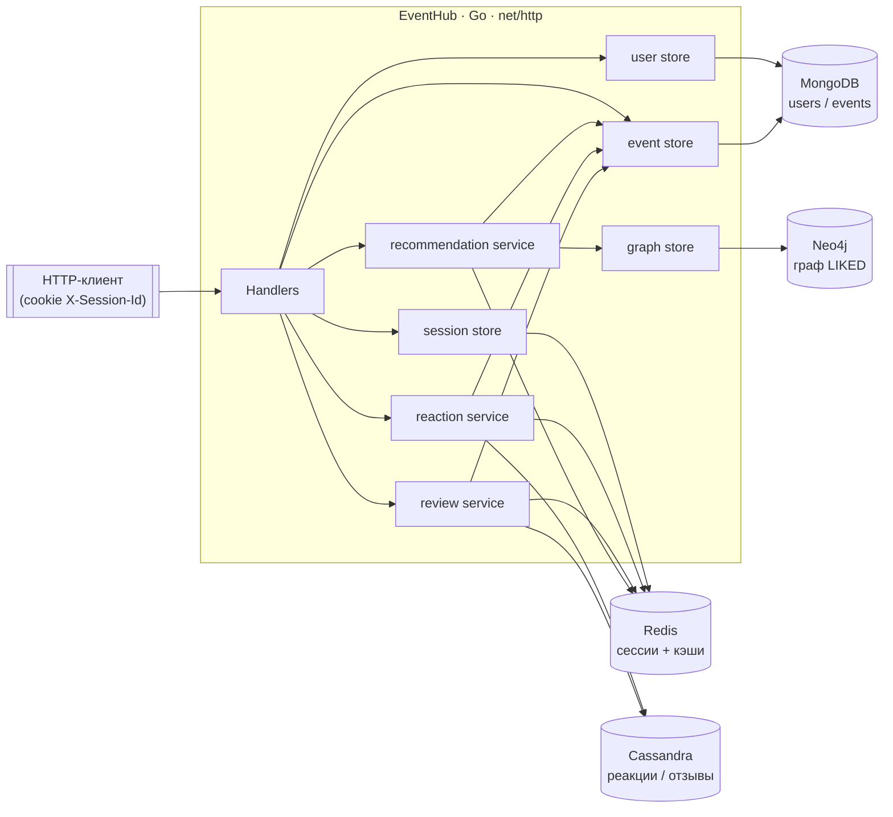
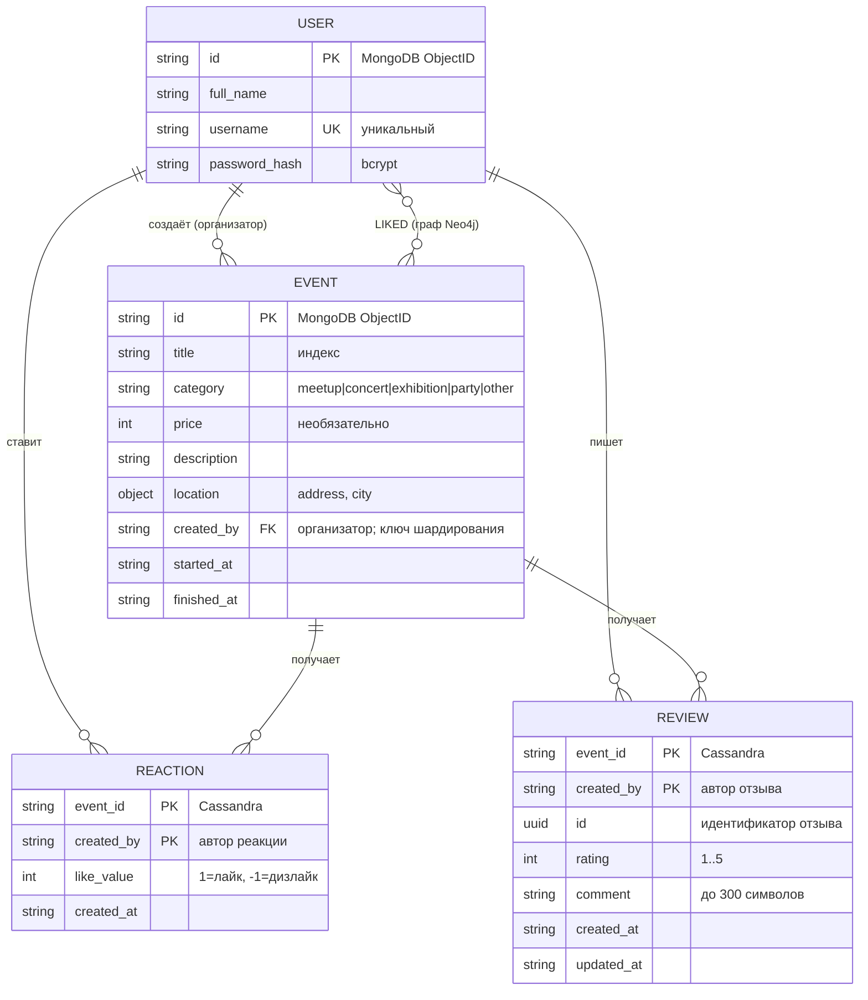
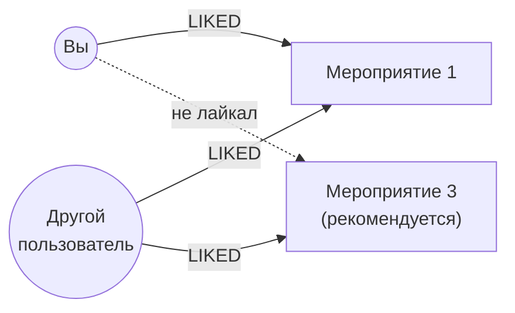
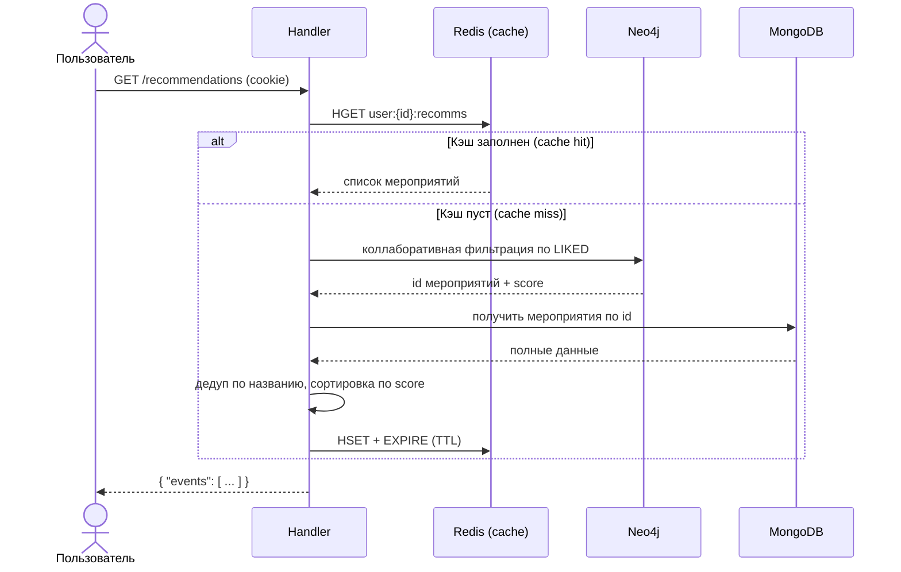

# EventHub

> Backend-сервис платформы мероприятий с многоуровневым NoSQL-хранением: пользователи и события в MongoDB, сессии и кэши в Redis, реакции и отзывы в Cassandra, граф рекомендаций в Neo4j.

[](https://github.com/ruskaof/nosql-labs/actions/workflows/eventhub.yml)


## Содержание

- [Обзор](#обзор)
- [Технологический стек](#технологический-стек)
- [Архитектура проекта](#архитектура-проекта)
  - [Структура пакетов](#структура-пакетов)
  - [Схема взаимодействия компонентов](#схема-взаимодействия-компонентов)
  - [Основные сущности](#основные-сущности)
  - [Распределение данных по хранилищам](#распределение-данных-по-хранилищам)
  - [Граф рекомендаций (Neo4j)](#граф-рекомендаций-neo4j)
- [Функциональные требования / Use Cases](#функциональные-требования--use-cases)
- [API](#api)
  - [Аутентификация](#аутентификация)
  - [Список эндпоинтов](#список-эндпоинтов)
  - [Примеры запросов и ответов](#примеры-запросов-и-ответов)
- [Инструкция по запуску](#инструкция-по-запуску)
- [Конфигурация](#конфигурация)
- [Тестирование](#тестирование)
- [FAQ](#faq)

## Обзор

**EventHub** — REST API для управления мероприятиями. Пользователи регистрируются,
создают и ищут мероприятия, ставят лайки/дизлайки, оставляют отзывы и получают
персональные рекомендации.

Проект развивается поэтапно в рамках лабораторных работ курса
[NoSQL-баз данных (ndbx)](https://github.com/sitnikovik/ndbx) и демонстрирует
применение **четырёх** разных NoSQL-хранилищ под разные задачи:

| Хранилище | Назначение |
|-----------|-----------|
| **MongoDB** | Основное хранилище пользователей и мероприятий (шардированный кластер) |
| **Redis** | Сессии, кэш реакций, кэш отзывов, кэш рекомендаций |
| **Cassandra** | Реакции (лайки/дизлайки) и отзывы на мероприятия |
| **Neo4j** | Граф для рекомендаций мероприятий (коллаборативная фильтрация) |

## Технологический стек

| Категория | Технология | Назначение |
|-----------|------------|-----------|
| Язык | [Go](https://go.dev/) 1.25 | Язык реализации сервиса |
| HTTP | стандартная библиотека `net/http` | HTTP-сервер и маршрутизация (без внешнего фреймворка) |
| Сборка / запуск | [Docker](https://www.docker.com/) + Docker Compose, `make` | Контейнеризация и оркестрация всех зависимостей |
| База данных | [MongoDB](https://www.mongodb.com/) 8 | Пользователи и мероприятия (шардирование + репликация) |
| База данных | [Redis](https://redis.io/) 8 | Сессии и кэши (Cache-Aside) |
| База данных | [Cassandra](https://cassandra.apache.org/) 5 | Реакции и отзывы |
| База данных | [Neo4j](https://neo4j.com/) 5 | Граф рекомендаций |

### Ключевые библиотеки

| Библиотека | Назначение |
|------------|-----------|
| [`go.mongodb.org/mongo-driver/v2`](https://github.com/mongodb/mongo-go-driver) | Официальный драйвер MongoDB |
| [`github.com/redis/go-redis/v9`](https://github.com/redis/go-redis) | Клиент Redis |
| [`github.com/gocql/gocql`](https://github.com/gocql/gocql) | Драйвер Cassandra (CQL) |
| [`github.com/neo4j/neo4j-go-driver/v5`](https://github.com/neo4j/neo4j-go-driver) | Драйвер Neo4j (Bolt) |
| [`golang.org/x/crypto/bcrypt`](https://pkg.go.dev/golang.org/x/crypto/bcrypt) | Хэширование паролей |

## Архитектура проекта

Сервис построен слоями: **handler** (HTTP) → **service** (бизнес-логика, кэширование) →
**store** (доступ к конкретной БД). Каждый домен (события, пользователи, реакции,
отзывы, рекомендации, сессии) изолирован в своём пакете.

### Структура пакетов

```text
.
├── cmd/
│   ├── app/
│   │   └── main.go                # Точка входа: конфиг, подключения к БД, роутинг, DI
│   └── internal/
│       ├── config/                # Загрузка конфигурации из переменных окружения
│       ├── db/
│       │   ├── indexes.go         # Создание индексов MongoDB при старте
│       │   ├── event/             # Mongo-хранилище мероприятий + модели
│       │   ├── user/              # Mongo-хранилище пользователей + модели
│       │   └── session/           # Интерфейс сессий + реализация на Redis
│       ├── graph/                 # Neo4j: узлы User/Event, связи LIKED, запрос рекомендаций
│       ├── handler/               # HTTP-обработчики (auth, events, users, reviews, …)
│       ├── model/                 # DTO запросов (auth, event, user)
│       ├── reaction/              # Реакции: Cassandra-store + Redis-cache + service
│       ├── review/                # Отзывы: Cassandra-store + Redis-cache + service
│       └── recommendation/        # Рекомендации: Redis-cache + service (Neo4j + Mongo)
├── api/                           # Спецификация API (OpenAPI + Postman)
├── docs/                          # Диаграммы, схема БД (DBML), изображения
├── scripts/                       # Инициализация Cassandra (DDL)
├── docker-compose.yml             # Все сервисы и зависимости
├── Dockerfile                     # Multi-stage сборка приложения
├── Makefile                       # Команды запуска/остановки
└── .env.local                     # Единственный файл конфигурации
```

### Схема взаимодействия компонентов



### Основные сущности



> Связи между сущностями **прикладные** (по идентификаторам): движки NoSQL не
> обеспечивают ссылочную целостность. Полная схема в формате DBML —
> [docs/schema.dbml](docs/schema.dbml) (открывается на [dbdiagram.io](https://dbdiagram.io/d)).

### Распределение данных по хранилищам

| Сущность | Хранилище | Ключ / коллекция | Комментарий |
|----------|-----------|------------------|-------------|
| Пользователь | MongoDB | коллекция `users` | Уникальный индекс по `username` |
| Мероприятие | MongoDB | коллекция `events` | Шардирование по `created_by` (hashed) |
| Сессия | Redis | `sid:{session_id}` (hash + TTL) | Хранит `user_id`, если авторизован |
| Реакция | Cassandra | `event_reactions` | PK `((event_id), created_by)` |
| Отзыв | Cassandra | `event_reviews` | PK `((event_id), created_by)` |
| Кэш реакций | Redis | `event:{md5(title)}:reactions` | Cache-Aside, TTL |
| Кэш отзывов | Redis | `event:{md5(title)}:reviews` | Cache-Aside, TTL |
| Кэш рекомендаций | Redis | `user:{user_id}:recomms` | Cache-Aside, TTL |
| Граф лайков | Neo4j | `(:User)-[:LIKED]->(:Event)` | Источник рекомендаций |

### Граф рекомендаций (Neo4j)

Рекомендации строятся по принципу **коллаборативной фильтрации**: «пользователям,
которым понравилось то же, что и вам, понравилось также…». В графе хранятся только
связи; полные данные мероприятий берутся из MongoDB.



Алгоритм запроса (Cypher):

```cypher
MATCH (me:User {id: $userID})-[:LIKED]->(:Event)<-[:LIKED]-(other:User)-[:LIKED]->(rec:Event)
WHERE NOT (me)-[:LIKED]->(rec)
RETURN rec.id AS eventID, count(DISTINCT other) AS score
ORDER BY score DESC
```

Поток обработки запроса `GET /recommendations`:



## Функциональные требования / Use Cases

1. **Анонимная сессия.** Любой клиент может получить анонимную сессию (`POST /session`)
   и продлевать её. Сессия хранится в Redis с TTL.
2. **Регистрация и вход.** Пользователь регистрируется (`POST /users`) — создаётся запись
   в MongoDB, узел `User` в Neo4j и привязанная сессия. Вход (`POST /auth/login`) привязывает
   пользователя к сессии, выход (`POST /auth/logout`) её удаляет.
3. **Управление мероприятиями.** Авторизованный пользователь создаёт мероприятие
   (`POST /events`) и становится его организатором; может менять категорию, цену и город
   своего мероприятия (`PATCH /events/{id}`).
4. **Поиск и просмотр.** Любой может искать мероприятия с фильтрами (название, категория,
   город, диапазон цен и дат, организатор) и пагинацией, а также смотреть карточку
   мероприятия с агрегатами реакций и отзывов (`?include=reactions,reviews`).
5. **Реакции.** Авторизованный пользователь ставит лайк/дизлайк (`POST /events/{id}/like`,
   `/dislike`). Лайк дополнительно создаёт связь `LIKED` в графе для рекомендаций.
6. **Отзывы.** Авторизованный пользователь оставляет один отзыв на мероприятие
   (`rating` 1–5, `comment` до 300 символов), редактирует свой отзыв и читает чужие.
7. **Рекомендации.** Авторизованный пользователь получает персональные рекомендации
   (`GET /recommendations`) на основе лайков; результат кэшируется в Redis.

## API

Полная спецификация лежит в каталоге [`api/`](api/):

- **OpenAPI 3.0** — [api/openapi.yaml](api/openapi.yaml) (откройте в [Swagger Editor](https://editor.swagger.io/) или локальном Swagger UI — см. ниже)
- **Postman-коллекция** — [api/nosql-labs.postman_collection.json](api/nosql-labs.postman_collection.json) (с готовым end-to-end сценарием и проверками)

Локальный Swagger UI для `openapi.yaml`:

```bash
docker run --rm -p 8081:8080 \
  -e SWAGGER_JSON=/spec/openapi.yaml \
  -v "$(pwd)/api:/spec" swaggerapi/swagger-ui
# затем откройте http://localhost:8081
```

### Аутентификация

Аутентификация — через cookie `X-Session-Id` (HttpOnly). Защищённые эндпоинты
возвращают `401`, если cookie отсутствует или сессия не привязана к пользователю.
Cookie выдаётся при `POST /session`, `POST /users` и `POST /auth/login`.

### Список эндпоинтов

Колонка **Auth** = требуется ли авторизованная сессия.

| Метод | Путь | Auth | Описание |
|-------|------|:----:|----------|
| `GET` | `/health` | — | Проверка работоспособности |
| `POST` | `/session` | — | Создать / обновить анонимную сессию |
| `POST` | `/users` | — | Регистрация |
| `GET` | `/users` | — | Список пользователей (`name`, `id`, `limit`, `offset`) |
| `GET` | `/users/{id}` | — | Профиль пользователя |
| `GET` | `/users/{id}/events` | — | Мероприятия пользователя |
| `POST` | `/auth/login` | — | Вход (привязать пользователя к сессии) |
| `POST` | `/auth/logout` | — | Выход (удалить сессию) |
| `POST` | `/events` | ✅ | Создать мероприятие |
| `GET` | `/events` | — | Список мероприятий (фильтры + пагинация, `include`) |
| `GET` | `/events/{id}` | — | Мероприятие по ID (`include=reactions,reviews`) |
| `PATCH` | `/events/{id}` | ✅ | Обновить категорию / цену / город (только организатор) |
| `POST` | `/events/{id}/like` | ✅ | Поставить лайк |
| `POST` | `/events/{id}/dislike` | ✅ | Поставить дизлайк |
| `POST` | `/events/{id}/reviews` | ✅ | Создать отзыв (`rating` 1–5, `comment` ≤ 300) |
| `GET` | `/events/{id}/reviews` | — | Список отзывов (`limit`, `offset`) |
| `PATCH` | `/events/{id}/reviews/{rid}` | ✅ | Обновить свой отзыв |
| `GET` | `/recommendations` | ✅ | Рекомендованные мероприятия |

**Параметры списка мероприятий** (`GET /events`, `GET /users/{id}/events`):
`title`, `id`, `category`, `city`, `user` (username организатора), `price_from`, `price_to`,
`date_from`, `date_to` (формат `YYYYMMDD`), `limit`, `offset`, `include` (`reactions`, `reviews`).

Допустимые `category`: `meetup`, `concert`, `exhibition`, `party`, `other`.

### Примеры запросов и ответов

> Примеры используют `curl` с файлом cookie (`-c`/`-b cookies.txt`), чтобы сохранять
> сессию между запросами.

**1. Создать анонимную сессию**

```bash
curl -i -c cookies.txt -X POST http://localhost:8080/session
```
```http
HTTP/1.1 201 Created
Set-Cookie: X-Session-Id=3f8a2c1d9e4b7f0a5c6d2e8b1a3f9c7d; Path=/; Max-Age=60; HttpOnly
```

**2. Регистрация**

```bash
curl -i -b cookies.txt -c cookies.txt -X POST http://localhost:8080/users \
  -H "Content-Type: application/json" \
  -d '{"full_name":"Джон Доу","username":"johndoe","password":"super-secret"}'
```
```http
HTTP/1.1 201 Created
Set-Cookie: X-Session-Id=...; Path=/; Max-Age=60; HttpOnly
```

**3. Вход**

```bash
curl -i -c cookies.txt -X POST http://localhost:8080/auth/login \
  -H "Content-Type: application/json" \
  -d '{"username":"johndoe","password":"super-secret"}'
```
```http
HTTP/1.1 204 No Content
```

**4. Создать мероприятие**

```bash
curl -s -b cookies.txt -X POST http://localhost:8080/events \
  -H "Content-Type: application/json" \
  -d '{
    "title": "Выставка российского зодчества",
    "address": "г. Москва, ул. Пушкина, дом Колотушкина",
    "started_at": "2026-04-01T12:00:00+03:00",
    "finished_at": "2026-04-01T23:00:00+03:00",
    "description": "Тут будет описание"
  }'
```
```json
{ "id": "12e9c0b1a2b3c3d5e6f7a8b7" }
```

**5. Список мероприятий с агрегатами**

```bash
curl -s "http://localhost:8080/events?title=зодчества&include=reactions,reviews&limit=10"
```
```json
{
  "events": [
    {
      "id": "12e9c0b1a2b3c3d5e6f7a8b7",
      "title": "Выставка российского зодчества",
      "category": "exhibition",
      "price": 0,
      "description": "Тут будет описание",
      "location": { "city": "Москва", "address": "г. Москва, ул. Пушкина, дом Колотушкина" },
      "created_at": "2026-03-14T14:59:32+03:00",
      "created_by": "65e9c0b1a2b3c4d5e6f7a8b9",
      "started_at": "2026-04-01T12:00:00+03:00",
      "finished_at": "2026-04-01T23:00:00+03:00",
      "reactions": { "likes": 12, "dislikes": 1 },
      "reviews": { "count": 3, "rating": 4.7 }
    }
  ],
  "count": 1
}
```

**6. Поставить лайк**

```bash
curl -i -b cookies.txt -X POST http://localhost:8080/events/12e9c0b1a2b3c3d5e6f7a8b7/like
```
```http
HTTP/1.1 204 No Content
```

**7. Создать отзыв**

```bash
curl -s -b cookies.txt -X POST http://localhost:8080/events/12e9c0b1a2b3c3d5e6f7a8b7/reviews \
  -H "Content-Type: application/json" \
  -d '{"rating":5,"comment":"Отличное мероприятие, очень понравилось!"}'
```
```json
{ "id": "a1b2c3d4-e5f6-11ee-8c99-0242ac120002" }
```

**8. Получить рекомендации**

```bash
curl -s -b cookies.txt http://localhost:8080/recommendations
```
```json
{
  "events": [
    {
      "id": "22e9c0b1a2b3c3d5e6f7a8c1",
      "title": "Концерт симфонического оркестра",
      "category": "concert",
      "location": { "city": "Москва", "address": "г. Москва, Зал Чайковского" },
      "created_at": "2026-03-10T10:00:00+03:00",
      "created_by": "75e9c0b1a2b3c4d5e6f7a8c2",
      "started_at": "2026-05-01T19:00:00+03:00",
      "finished_at": "2026-05-01T22:00:00+03:00"
    }
  ]
}
```

**9. Ошибка валидации**

```bash
curl -s -X POST http://localhost:8080/auth/login \
  -H "Content-Type: application/json" -d '{"username":"any","password":""}'
```
```json
{ "message": "invalid \"password\" field" }
```

## Инструкция по запуску

### Предварительные требования

- [Docker](https://docs.docker.com/get-docker/) и Docker Compose (v2)
- [`make`](https://www.gnu.org/software/make/) (необязательно — можно вызывать `docker compose` напрямую)
- Go 1.25+ — только если хотите собирать/запускать без Docker

### Пошаговый запуск

1. **Клонировать репозиторий:**
   ```bash
   git clone https://github.com/ruskaof/nosql-labs.git
   cd nosql-labs
   ```

2. **Проверить конфигурацию.** Файл [`.env.local`](.env.local) уже содержит рабочие
   настройки для локального запуска. При необходимости отредактируйте порты/пароли
   (см. раздел [Конфигурация](#конфигурация)).

3. **Запустить все сервисы:**
   ```bash
   make run        # docker compose --env-file .env.local up -d --build
   ```
   Поднимутся приложение, MongoDB (шардированный кластер + mongos), Redis, Cassandra
   и Neo4j. Первый старт занимает несколько минут: контейнеры инициализируют кластер
   MongoDB, keyspace Cassandra и проходят health-check.

4. **Проверить, что сервис отвечает:**
   ```bash
   curl http://localhost:8080/health
   # {"status":"ok"}
   ```

5. **(Опционально) Открыть Neo4j Browser:** http://localhost:7474
   (логин/пароль — из `NEO4J_USERNAME` / `NEO4J_PASSWORD`).

### Управление сервисами

```bash
make run       # запустить всё в фоновом режиме (с пересборкой)
make rund      # запустить с выводом логов (для отладки)
make services  # статус контейнеров
make stop      # остановить
make clean     # остановить и удалить тома (полная очистка данных)
```

### Запуск без Docker (локальная сборка)

Потребуются запущенные локально MongoDB, Redis, Cassandra и Neo4j, а также
переменные окружения из `.env.local` (с хостами `localhost`):

```bash
go build -C ./cmd/app -o ./app && ./cmd/app/app
```

## Конфигурация

Вся конфигурация — в едином файле [`.env.local`](.env.local); его читают и Docker
Compose, и само приложение.

### Приложение

| Переменная | Обязательная | Описание | По умолчанию |
|------------|:---:|----------|--------------|
| `APP_HOST` | да | Адрес, на котором слушает сервер | — |
| `APP_PORT` | да | Порт HTTP-сервера | — |
| `APP_USER_SESSION_TTL` | да | TTL сессии в секундах (> 0) | — |
| `APP_LIKE_TTL` | нет | TTL кэша реакций в секундах | `60` |
| `APP_EVENT_REVIEWS_TTL` | нет | TTL кэша отзывов в секундах | `120` |
| `APP_RECOMMENDATIONS_TTL` | нет | TTL кэша рекомендаций в секундах | `60` |

### Redis

| Переменная | Обязательная | Описание | По умолчанию |
|------------|:---:|----------|--------------|
| `REDIS_HOST` | нет | Хост Redis | `localhost` |
| `REDIS_PORT` | нет | Порт Redis | `6379` |
| `REDIS_PASSWORD` | нет | Пароль Redis | — |
| `REDIS_DB` | нет | Номер базы Redis | `0` |

### MongoDB

| Переменная | Обязательная | Описание | По умолчанию |
|------------|:---:|----------|--------------|
| `MONGODB_DATABASE` | да | Имя базы данных | — |
| `MONGODB_USER` | нет | Имя пользователя | — |
| `MONGODB_PASSWORD` | нет | Пароль пользователя | — |
| `MONGODB_HOST` | нет | Хост mongos | `localhost` |
| `MONGODB_PORT` | нет | Порт mongos | `27017` |
| `MONGODB_AUTH_SOURCE` | нет | База аутентификации | `admin` |
| `MONGO_CONFIG_PORT` | нет | Внутренний порт config-серверов (только compose) | `27017` |
| `MONGO_SHARD1_PORT` | нет | Внутренний порт шарда 1 (только compose) | `27018` |
| `MONGO_SHARD2_PORT` | нет | Внутренний порт шарда 2 (только compose) | `27019` |
| `MONGO_MONGOS_PORT` | нет | Внутренний порт mongos (только compose) | `27017` |

### Cassandra

| Переменная | Обязательная | Описание | По умолчанию |
|------------|:---:|----------|--------------|
| `CASSANDRA_HOSTS` | да | Хосты через запятую | — |
| `CASSANDRA_PORT` | да | Порт | — |
| `CASSANDRA_KEYSPACE` | да | Keyspace (`^[A-Za-z][A-Za-z0-9_]{0,47}$`) | — |
| `CASSANDRA_USERNAME` | нет | Имя пользователя | — |
| `CASSANDRA_PASSWORD` | нет | Пароль | — |
| `CASSANDRA_CONSISTENCY` | нет | Уровень консистентности | `ONE` |

### Neo4j

| Переменная | Обязательная | Описание | По умолчанию |
|------------|:---:|----------|--------------|
| `NEO4J_URL` | нет | Bolt URL | `bolt://localhost:7687` |
| `NEO4J_USERNAME` | нет | Имя пользователя | — |
| `NEO4J_PASSWORD` | нет | Пароль | — |

## Тестирование

В проекте применяется **чёрно-ящичное (acceptance) тестирование** API: сервис
поднимается целиком и проверяется по HTTP. Есть два способа.

### 1. Postman-коллекция

Коллекция [api/nosql-labs.postman_collection.json](api/nosql-labs.postman_collection.json)
содержит полный end-to-end сценарий (сессия → регистрация → события → лайки → отзывы →
рекомендации) и группу негативных проверок (`Error cases`), каждый запрос — с тестами.

В Postman: импортируйте коллекцию и запустите через **Collection Runner**.

Из командной строки через [Newman](https://github.com/postmanlabs/newman):

```bash
make run   # поднять сервис на http://localhost:8080
npx newman run api/nosql-labs.postman_collection.json
```

### 2. Автопроверка (CI)

При push и pull request в `main` GitHub Actions ([.github/workflows/eventhub.yml](.github/workflows/eventhub.yml))
запускает официальный автограйдер курса
([sitnikovik/ndbx](https://github.com/sitnikovik/ndbx)). Номер проверяемой лабораторной
берётся из файла [`.labrc`](.labrc). Автограйдер поднимает сервис и прогоняет
acceptance-тесты для соответствующей лабораторной работы.

> Текущая лабораторная: **7 — Neo4j: связи и рекомендации**. Все предыдущие лабораторные
> (1–6) проверяются на отсутствие регрессий.

## FAQ

**Q: На каком языке написана документация?**
A: На русском, как и материалы курса.

**Q: Где взять примеры запросов?**
A: В разделе [Примеры запросов и ответов](#примеры-запросов-и-ответов), в
[OpenAPI-спецификации](api/openapi.yaml) и в [Postman-коллекции](api/nosql-labs.postman_collection.json).

**Q: Почему сразу четыре базы данных?**
A: Это учебный проект курса по NoSQL: каждая БД закрывает свой класс задач — документная
(MongoDB), ключ-значение (Redis), широкие колонки (Cassandra), граф (Neo4j).

**Q: Как устроена аутентификация?**
A: Через cookie `X-Session-Id`, указывающую на сессию в Redis. Подробнее — раздел
[Аутентификация](#аутентификация).

**Q: Почему агрегаты реакций и отзывов считаются по названию, а не по id?**
A: Одинаковые по названию мероприятия считаются одним; кэш реакций/отзывов и дедупликация
рекомендаций работают по названию (`title`).

**Q: Как посмотреть схему БД и диаграммы?**
A: Диаграммы (Mermaid) встроены в этот README и рендерятся прямо на GitHub. Схема БД —
в [docs/schema.dbml](docs/schema.dbml) (формат [DBML](https://dbml.dbdiagram.io/home/),
просмотр на [dbdiagram.io](https://dbdiagram.io/d)). Скриншоты размещайте в
[docs/img](docs/img).

**Q: Куда коммитить новую лабораторную?**
A: В отдельную ветку `feature/lab-N`, обновив номер в [`.labrc`](.labrc). Правила —
в [CONTRIBUTING.md](CONTRIBUTING.md).
